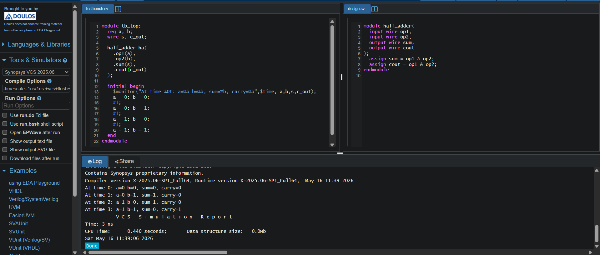
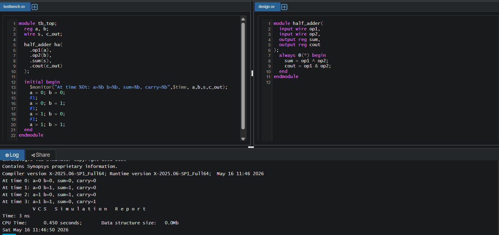
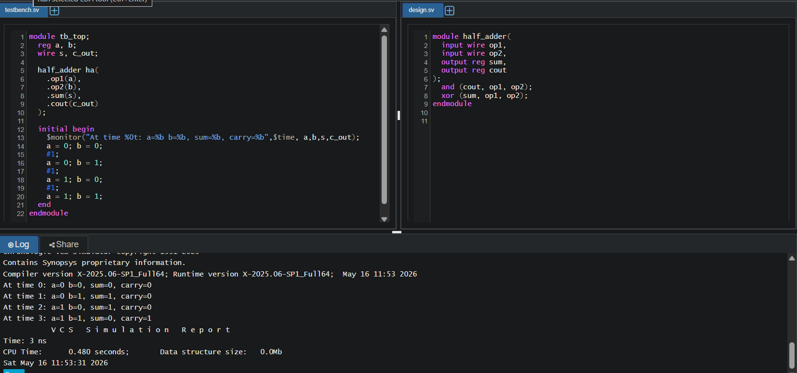
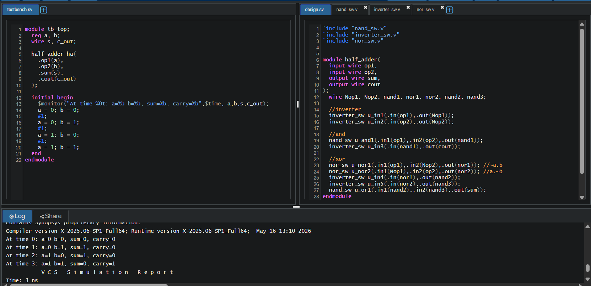
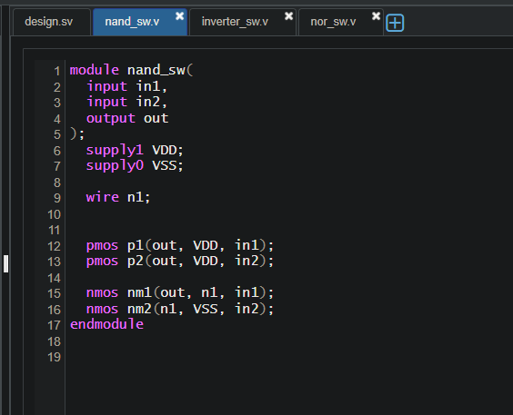
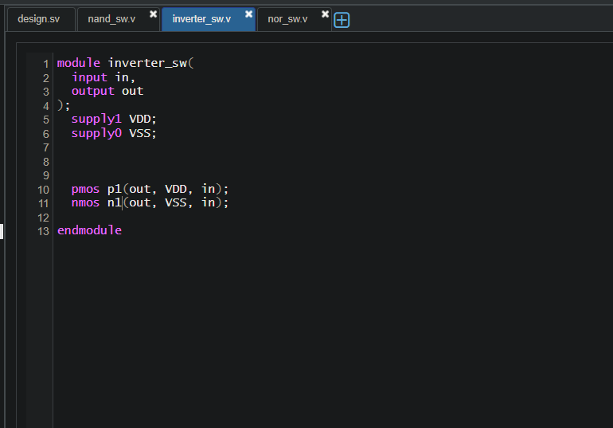
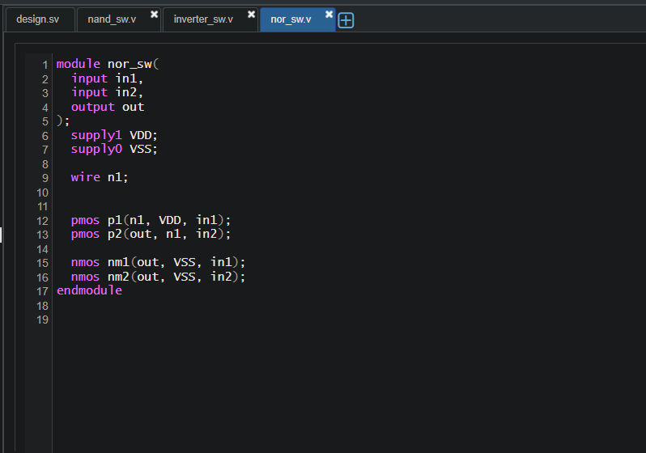

# Verilog Half Adder: Multi-Abstraction Implementation

## Overview

This repository demonstrates the implementation of a digital **Half Adder** using multiple abstraction levels in Verilog/SystemVerilog.  
The project showcases how the same combinational circuit can be modeled progressively from high-level behavioral descriptions down to transistor-level CMOS design.

All implementations were simulated and verified using **Synopsys VCS** on EDA Playground.

---

# Half Adder Logic

A Half Adder performs binary addition for two single-bit inputs.

## Truth Table

| op1 | op2 | sum | cout |
|------|------|------|------|
| 0 | 0 | 0 | 0 |
| 0 | 1 | 1 | 0 |
| 1 | 0 | 1 | 0 |
| 1 | 1 | 0 | 1 |

## Boolean Equations

```text
sum  = op1 XOR op2
cout = op1 AND op2
```

---

# Repository Structure

```text
half-adders-at-different-forms/
├── README.md
├── images
│   ├── HA1.png
│   ├── HA2.png
│   ├── HA3.png
│   ├── hasw1.png
│   ├── hasw2.png
│   ├── hasw3.png
│   └── hasw4.png
│
└── src
    ├── design_dataflow.v
    ├── design_behavioral.v
    ├── design_gate.v
    ├── tb.sv
    │
    └── switch_level
        ├── design_top.v
        ├── nand_sw.v
        ├── inverter_sw.v
        └── nor_sw.v
```

---

# Implementations

---

## 1. Dataflow Modeling

The Dataflow implementation uses continuous assignment statements (`assign`) to directly model Boolean equations.

### Features
- Compact implementation
- Suitable for combinational logic
- Easy synthesis mapping

### Logic

```verilog
assign sum  = op1 ^ op2;
assign cout = op1 & op2;
```

### Simulation Result



---

## 2. Behavioral Modeling

The Behavioral implementation uses procedural blocks (`always @(*)`) to describe circuit functionality.

### Features
- Higher abstraction level
- Focuses on functionality rather than hardware structure
- Useful for complex control logic

### Logic

```verilog
always @(*) begin
    sum  = op1 ^ op2;
    cout = op1 & op2;
end
```

### Simulation Result



---

## 3. Gate-Level Modeling

The Gate-Level implementation uses built-in Verilog gate primitives.

### Features
- Structural hardware representation
- Explicit gate instantiation
- Useful for learning logic construction

### Logic

```verilog
and (cout, op1, op2);
xor (sum, op1, op2);
```

### Simulation Result



---

## 4. Switch-Level Modeling

The Switch-Level implementation models the Half Adder using CMOS transistor primitives (`pmos`, `nmos`).

The design is built hierarchically using:
- `nand_sw`
- `nor_sw`
- `inverter_sw`

These modules internally model transistor-level pull-up and pull-down networks.

### Features
- Lowest abstraction level
- Demonstrates CMOS behavior
- Useful for VLSI and transistor-level understanding

### Simulation Results

#### Top-Level Half Adder



#### NAND Implementation



#### Inverter Implementation



#### NOR Implementation



---

# Testbench

A common SystemVerilog testbench (`tb.sv`) was used for all implementations.

The testbench:
- applies all possible input combinations
- monitors outputs using `$monitor`
- verifies functional correctness

## Input Sequence

```text
00
01
10
11
```

---

# Learning Objectives

This repository helps understand:

- Verilog abstraction levels
- Combinational logic modeling
- Structural vs Behavioral coding
- CMOS transistor implementation
- Hierarchical module design
- Verification using testbenches

---

# Key Concepts Covered

- Continuous Assignments
- Procedural Blocks
- Gate Primitives
- CMOS Pull-Up Networks
- CMOS Pull-Down Networks
- Structural Modeling
- Hierarchical Design
- Simulation and Verification

---
# Future Improvements

Possible future extensions:

- Full Adder implementation
- Ripple Carry Adder
- CMOS layout design
- Waveform generation
- Synthesis reports
- Timing analysis
- Power estimation

---

# Author

Narendaran S G

---

# License

This project is intended for educational and learning purposes.
